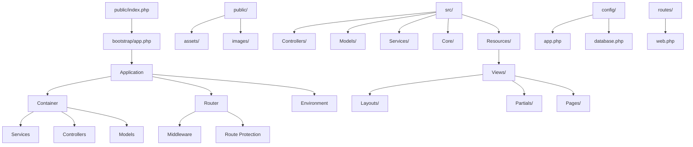
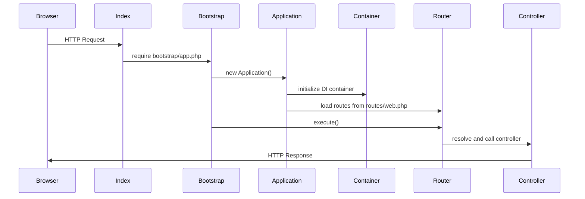
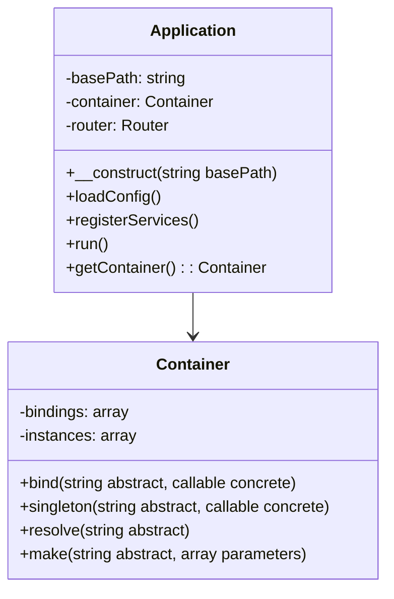
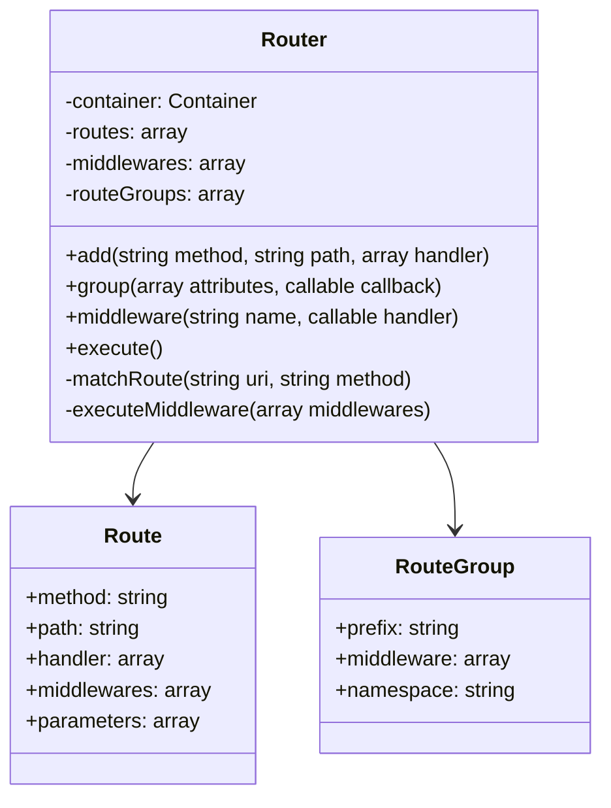
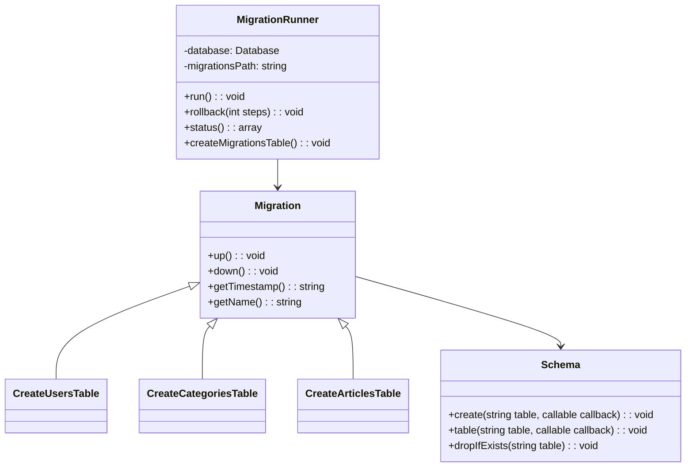
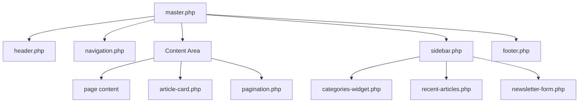
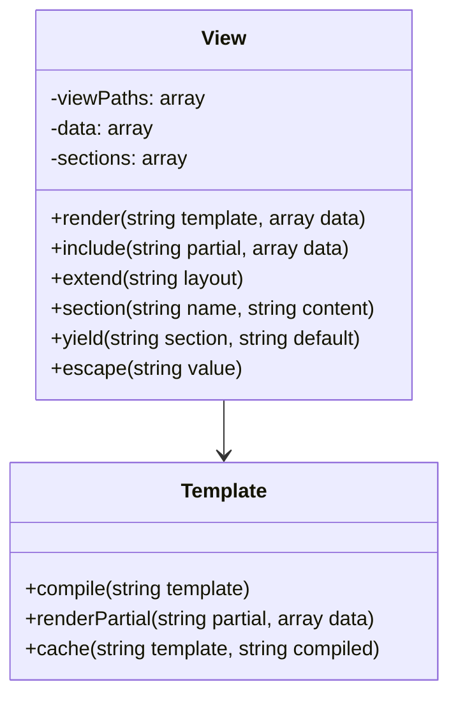
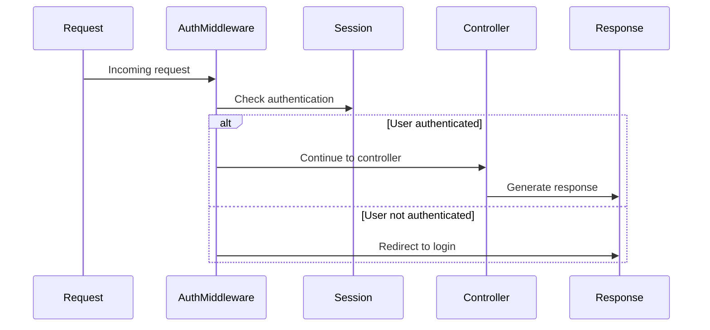
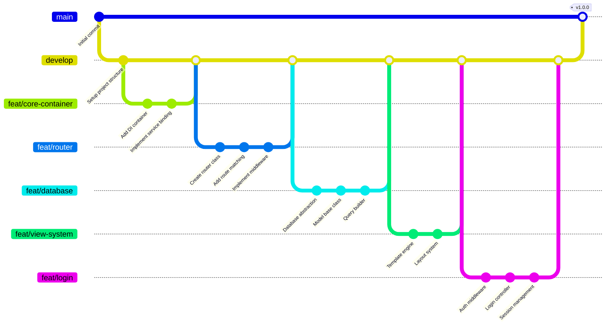

# Custom PHP Framework with Dependency Injection - Design Document

## Overview

This project implements a complete PHP framework from scratch featuring dependency injection container, custom routing system, environment configuration, MySQL abstraction, and a templating system. The application serves as a blog platform with articles, categories, authors, newsletter functionality, and visitor management.

### Core Requirements
- Clean architecture with separation of concerns
- Dependency injection container system
- Custom router with middleware support
- Environment configuration (.env reader)
- MySQL database abstraction
- Template engine with master layouts and partials
- Bootstrap 5 integration
- Blog functionality (articles, categories, authors, newsletter)

## Project Implementation Roadmap

### Phase 1: Repository Setup and Core Framework

```bash
# Step 1: Initialize Git repository
git init
git remote add origin https://github.com/mervy/qoder-projetct-one-php-mvc.git

# Step 2: Create initial project structure
mkdir -p public/{css,js,images}
mkdir -p bootstrap
mkdir -p config
mkdir -p routes
mkdir -p src/{Core,Controllers,Models,Services,Middleware}
mkdir -p src/Resources/Views/{layouts,partials,pages}
mkdir -p storage/{logs,cache,views}
mkdir -p database/{migrations,seeds}
mkdir -p tests/{Unit,Feature,Integration}

# Step 3: Create .gitignore
echo "vendor/" > .gitignore
echo ".env" >> .gitignore
echo "storage/logs/*" >> .gitignore
echo "storage/cache/*" >> .gitignore
echo "!storage/logs/.gitkeep" >> .gitignore
echo "!storage/cache/.gitkeep" >> .gitignore

# Step 4: Initialize composer
composer init --name="mervy/qoder-project-one-php-mvc" \
              --description="Custom PHP Framework with MVC Architecture" \
              --type="project" \
              --require="php:^8.0"

# Step 5: Initial commit
git add .
git commit -m "Initial commit: Project structure setup"
git push -u origin main

# Step 6: Create develop branch
git checkout -b develop
git push -u origin develop
```

### Phase 2: Feature Branch Implementation

#### Branch 1: Core Container (feat/core-container)
```bash
git checkout develop
git checkout -b feat/core-container

# Implement files:
# - src/Core/Container.php
# - src/Core/Application.php
# - bootstrap/app.php
# - public/index.php

git add .
git commit -m "feat(container): implement dependency injection container"
git commit -m "feat(container): add application bootstrap system"
git commit -m "feat(container): create entry point with path constants"

git checkout develop
git merge feat/core-container --no-ff -m "Merge feat/core-container into develop"
git push origin develop
```

#### Branch 2: Environment Config (feat/env-config)
```bash
git checkout develop
git checkout -b feat/env-config

# Implement files:
# - src/Core/Environment.php
# - config/app.php
# - config/database.php
# - config/view.php
# - .env.example

git add .
git commit -m "feat(env): implement environment configuration loader"
git commit -m "feat(env): add configuration files for app, database, view"
git commit -m "feat(env): create .env.example template"

git checkout develop
git merge feat/env-config --no-ff -m "Merge feat/env-config into develop"
git push origin develop
```

#### Branch 3: Database System (feat/database)
```bash
git checkout develop
git checkout -b feat/database

# Implement files:
# - src/Core/Database.php
# - src/Core/Model.php
# - database/migrations/*.php
# - database/schema.sql

git add .
git commit -m "feat(database): implement PDO database abstraction"
git commit -m "feat(database): create base model with ORM features"
git commit -m "feat(database): add migration system with 7 tables"
git commit -m "feat(database): create complete database schema"

git checkout develop
git merge feat/database --no-ff -m "Merge feat/database into develop"
git push origin develop
```

#### Branch 4: Router System (feat/router)
```bash
git checkout develop
git checkout -b feat/router

# Implement files:
# - src/Core/Router.php
# - routes/web.php
# - src/Middleware/AuthMiddleware.php
# - src/Middleware/GuestMiddleware.php

git add .
git commit -m "feat(router): implement custom router with parameter extraction"
git commit -m "feat(router): add middleware pipeline support"
git commit -m "feat(router): create route grouping functionality"
git commit -m "feat(router): implement basic middleware classes"

git checkout develop
git merge feat/router --no-ff -m "Merge feat/router into develop"
git push origin develop
```

### Phase 3: Models and Controllers Implementation

#### Branch 5: Blog Models (feat/blog-models)
```bash
git checkout develop
git checkout -b feat/blog-models

# Implement files:
# - src/Models/Article.php
# - src/Models/Category.php
# - src/Models/Author.php
# - src/Models/Visitor.php
# - src/Models/Newsletter.php
# - src/Models/User.php

git add .
git commit -m "feat(models): implement Article model with relationships"
git commit -m "feat(models): create Category model with slug generation"
git commit -m "feat(models): add Author model with social links"
git commit -m "feat(models): implement Visitor tracking model"
git commit -m "feat(models): create Newsletter subscription model"
git commit -m "feat(models): add User model with authentication"

git checkout develop
git merge feat/blog-models --no-ff -m "Merge feat/blog-models into develop"
git push origin develop
```

#### Branch 6: Controllers (feat/controllers)
```bash
git checkout develop
git checkout -b feat/controllers

# Implement files:
# - src/Controllers/HomeController.php
# - src/Controllers/ArticleController.php
# - src/Controllers/CategoryController.php
# - src/Controllers/AuthorController.php
# - src/Controllers/NewsletterController.php
# - src/Controllers/DashboardController.php

git add .
git commit -m "feat(controllers): implement HomeController with latest articles"
git commit -m "feat(controllers): create ArticleController with CRUD operations"
git commit -m "feat(controllers): add CategoryController with article listing"
git commit -m "feat(controllers): implement AuthorController with author pages"
git commit -m "feat(controllers): create NewsletterController for subscriptions"
git commit -m "feat(controllers): add DashboardController for admin panel"

git checkout develop
git merge feat/controllers --no-ff -m "Merge feat/controllers into develop"
git push origin develop
```

### Phase 4: View System and Templates

#### Branch 7: View System (feat/view-system)
```bash
git checkout develop
git checkout -b feat/view-system

# Implement files:
# - src/Core/View.php
# - src/Resources/Views/layouts/master.php
# - src/Resources/Views/partials/*.php
# - src/Resources/Views/pages/**/*.php

git add .
git commit -m "feat(views): implement template engine with layout inheritance"
git commit -m "feat(views): create master layout with Bootstrap 5"
git commit -m "feat(views): add partial views for header, footer, navigation"
git commit -m "feat(views): implement blog page templates"
git commit -m "feat(views): create dashboard admin templates"

git checkout develop
git merge feat/view-system --no-ff -m "Merge feat/view-system into develop"
git push origin develop
```

### Phase 5: Authentication and Services

#### Branch 8: Authentication (feat/login)
```bash
git checkout develop
git checkout -b feat/login

# Implement files:
# - src/Services/AuthService.php
# - src/Controllers/LoginController.php
# - src/Middleware/AdminMiddleware.php
# - login/register views

git add .
git commit -m "feat(auth): implement authentication service with sessions"
git commit -m "feat(auth): create login/logout controllers"
git commit -m "feat(auth): add password hashing and verification"
git commit -m "feat(auth): implement remember me functionality"
git commit -m "feat(auth): create admin middleware for route protection"

git checkout develop
git merge feat/login --no-ff -m "Merge feat/login into develop"
git push origin develop
```

### Phase 6: Frontend and Assets

#### Branch 9: Bootstrap Integration (feat/bootstrap-integration)
```bash
git checkout develop
git checkout -b feat/bootstrap-integration

# Implement files:
# - public/css/app.css
# - public/js/app.js
# - Bootstrap 5 integration
# - Icon fonts
# - Responsive design

git add .
git commit -m "feat(frontend): integrate Bootstrap 5 framework"
git commit -m "feat(frontend): add custom CSS for blog styling"
git commit -m "feat(frontend): implement responsive navigation"
git commit -m "feat(frontend): create article card components"
git commit -m "feat(frontend): add JavaScript for interactive features"

git checkout develop
git merge feat/bootstrap-integration --no-ff -m "Merge feat/bootstrap-integration into develop"
git push origin develop
```

### Phase 7: Testing and Deployment

#### Branch 10: Testing Framework (feat/testing)
```bash
git checkout develop
git checkout -b feat/testing

# Implement files:
# - tests/Unit/**/*Test.php
# - tests/Feature/**/*Test.php
# - phpunit.xml
# - TestCase.php

git add .
git commit -m "feat(tests): implement unit tests for core components"
git commit -m "feat(tests): create feature tests for blog functionality"
git commit -m "feat(tests): add database testing with transactions"
git commit -m "feat(tests): implement authentication testing"

git checkout develop
git merge feat/testing --no-ff -m "Merge feat/testing into develop"
git push origin develop
```

### Phase 8: Production Release

```bash
# Create release branch
git checkout develop
git checkout -b release/v1.0.0

# Final preparations
git commit -m "chore(release): update documentation for v1.0.0"
git commit -m "chore(release): optimize autoloader and cache"

# Merge to main
git checkout main
git merge release/v1.0.0 --no-ff -m "Release v1.0.0: Complete PHP MVC Framework

Features:
- Custom dependency injection container
- Advanced routing system with middleware
- Database abstraction with ORM
- Template engine with layouts
- Complete blog functionality
- Authentication system
- Bootstrap 5 integration
- Comprehensive testing suite"

git tag -a v1.0.0 -m "Version 1.0.0 - Initial release"
git push origin main --tags

# Merge back to develop
git checkout develop
git merge release/v1.0.0 --no-ff
git push origin develop
```

## Implementation Timeline

| Phase | Estimated Time | Features |
|-------|---------------|----------|
| **Phase 1** | 1-2 days | Repository setup, basic structure |
| **Phase 2** | 3-4 days | Core framework (Container, Environment, Database, Router) |
| **Phase 3** | 2-3 days | Models and Controllers |
| **Phase 4** | 3-4 days | View system and templates |
| **Phase 5** | 2-3 days | Authentication and services |
| **Phase 6** | 2-3 days | Frontend integration |
| **Phase 7** | 2-3 days | Testing framework |
| **Phase 8** | 1 day | Production release |
| **Total** | **16-23 days** | Complete framework |

## Next Steps

1. **Start with Phase 1**: Initialize the repository and create the basic structure
2. **Follow the branch strategy**: Use `feat/feature-name` branches with `--no-ff` merges
3. **Implement incrementally**: Each phase builds upon the previous one
4. **Test as you go**: Add tests for each component as it's implemented
5. **Document progress**: Update README.md and documentation

The design document serves as your complete blueprint - now you can implement each phase systematically, committing and pushing your progress to GitHub as you build the framework.

## Technology Stack & Dependencies

- **Language**: PHP 8.0+
- **Dependency Management**: Composer
- **Database**: MySQL
- **Frontend Framework**: Bootstrap 5
- **Icons**: Bootstrap Icons
- **Environment Management**: Custom .env reader
- **Version Control**: Git
- **Repository**: https://github.com/mervy/qoder-projetct-one-php-mvc.git

## Project Setup Instructions

### 1. Git Repository Initialization

```bash
# Initialize Git repository
git init

# Add remote origin
git remote add origin https://github.com/mervy/qoder-projetct-one-php-mvc.git

# Create initial .gitignore
echo "vendor/" > .gitignore
echo ".env" >> .gitignore
echo "storage/logs/" >> .gitignore
echo "storage/cache/" >> .gitignore
echo "node_modules/" >> .gitignore
echo ".DS_Store" >> .gitignore
echo "Thumbs.db" >> .gitignore

# Create initial commit
git add .
git commit -m "Initial commit: Custom PHP Framework setup"

# Push to GitHub
git branch -M main
git push -u origin main
```

### 2. Composer Setup

```bash
# Initialize composer.json
composer init

# Add PSR-4 autoloading
# Edit composer.json to include:
{
    "name": "mervy/qoder-project-one-php-mvc",
    "description": "Custom PHP Framework with MVC Architecture",
    "type": "project",
    "autoload": {
        "psr-4": {
            "Kurama\\": "src/"
        }
    },
    "require": {
        "php": "^8.0"
    },
    "require-dev": {
        "phpunit/phpunit": "^9.0"
    }
}

# Install dependencies
composer install
```

### 3. Environment Configuration

```bash
# Create .env file
cp .env.example .env

# Configure environment variables
APP_NAME="Qoder PHP MVC"
APP_DEBUG=true
APP_TIMEZONE="America/Sao_Paulo"
APP_URL="http://localhost:8000"

DB_CONNECTION=mysql
DB_HOST=127.0.0.1
DB_PORT=3306
DB_DATABASE=qoder_blog
DB_USERNAME=root
DB_PASSWORD=

# Test database configuration
DB_TEST_DATABASE=qoder_blog_test
DB_TEST_USERNAME=root
DB_TEST_PASSWORD=
```

### 4. Database Setup for Development

```bash
# Connect to MySQL as root (no password)
mysql -u root

# Create development database
CREATE DATABASE qoder_blog CHARACTER SET utf8mb4 COLLATE utf8mb4_unicode_ci;

# Create test database
CREATE DATABASE qoder_blog_test CHARACTER SET utf8mb4 COLLATE utf8mb4_unicode_ci;

# Show databases to confirm
SHOW DATABASES;

# Exit MySQL
exit;
```

### 4. Directory Structure Creation

```bash
# Create necessary directories
mkdir -p public/{css,js,images}
mkdir -p bootstrap
mkdir -p config
mkdir -p routes
mkdir -p src/{Core,Controllers,Models,Services,Middleware}
mkdir -p src/Resources/Views/{layouts,partials,pages}
mkdir -p storage/{logs,cache,views}
mkdir -p tests/{Unit,Feature,Integration}
```

## Architecture



### Project Structure

```
/
├── composer.json                # Dependencies
├── .env                         # Environment variables
├── public/                      # Web server document root
│   ├── index.php               # Entry point
│   ├── css/
│   ├── js/
│   └── images/
├── bootstrap/                   # Application bootstrap
│   └── app.php                 # Application initialization
├── config/                      # Configuration files
│   ├── app.php
│   ├── database.php
│   └── view.php
├── routes/                      # Route definitions
│   └── web.php
└── src/                         # Core application
    ├── Core/                    # Framework core
    │   ├── Application.php      # Main application class
    │   ├── Container.php
    │   ├── Router.php
    │   ├── Environment.php
    │   ├── Database.php
    │   └── View.php
    ├── Controllers/             # Request handlers
    │   ├── HomeController.php
    │   ├── ArticleController.php
    │   ├── CategoryController.php
    │   ├── AuthorController.php
    │   ├── NewsletterController.php
    │   └── DashboardController.php
    ├── Models/                  # Data layer
    │   ├── Article.php
    │   ├── Category.php
    │   ├── Author.php
    │   ├── Visitor.php
    │   └── Newsletter.php
    ├── Services/                # Business logic
    │   ├── ArticleService.php
    │   ├── AuthService.php
    │   └── NewsletterService.php
    ├── Middleware/              # Request middleware
    │   ├── AuthMiddleware.php
    │   └── GuestMiddleware.php
    └── Resources/               # Templates & views
        └── Views/
            ├── layouts/
            │   └── master.php
            ├── partials/
            │   ├── header.php
            │   ├── footer.php
            │   ├── navigation.php
            │   └── sidebar.php
            └── pages/
                ├── home/
                ├── articles/
                ├── categories/
                └── dashboard/
```

## Application Bootstrap Flow



### Entry Point (public/index.php)
```php
<?php

// Define path constants
define('BASE_PATH', dirname(__DIR__));
define('PUBLIC_PATH', __DIR__);

// Require the application bootstrap
require_once BASE_PATH . '/bootstrap/app.php';
```

### Application Bootstrap (bootstrap/app.php)
```php
<?php

require_once BASE_PATH . '/vendor/autoload.php';

use Kurama\Core\Application;
use Kurama\Core\Environment;
use Kurama\Core\Container;

// Load environment variables
$env = new Environment();
$env->load(BASE_PATH . '/.env');

// Create application instance
$app = new Application(BASE_PATH);

// Load configuration
$app->loadConfig();

// Load routes
require_once BASE_PATH . '/routes/web.php';

// Run the application
$app->run();
```

## Core Implementation Files

### 1. Entry Point (public/index.php)

```php
<?php

// Define path constants
define('BASE_PATH', dirname(__DIR__));
define('PUBLIC_PATH', __DIR__);
define('CONFIG_PATH', BASE_PATH . '/config');
define('STORAGE_PATH', BASE_PATH . '/storage');

// Error reporting for development
if (file_exists(BASE_PATH . '/.env')) {
    $env_debug = trim(file_get_contents(BASE_PATH . '/.env'));
    if (strpos($env_debug, 'APP_DEBUG=true') !== false) {
        error_reporting(E_ALL);
        ini_set('display_errors', 1);
    }
}

// Require the application bootstrap
require_once BASE_PATH . '/bootstrap/app.php';
```

### 2. Application Bootstrap (bootstrap/app.php)

```php
<?php

require_once BASE_PATH . '/vendor/autoload.php';

use Kurama\Core\Application;
use Kurama\Core\Environment;
use Kurama\Core\Container;
use Kurama\Core\Database;
use Kurama\Core\Router;
use Kurama\Core\View;

// Load environment variables
$env = new Environment();
$env->load(BASE_PATH . '/.env');

// Create application instance
$app = new Application(BASE_PATH);

// Register core services
$app->getContainer()->singleton(Database::class, function() {
    $config = require CONFIG_PATH . '/database.php';
    return new Database($config['connections'][$config['default']]);
});

$app->getContainer()->singleton(View::class, function() {
    $config = require CONFIG_PATH . '/view.php';
    return new View($config);
});

$app->getContainer()->singleton(Router::class, function($container) {
    return new Router($container);
});

// Load configuration
$app->loadConfig();

// Load routes
require_once BASE_PATH . '/routes/web.php';

// Run the application
$app->run();
```

### 3. Core Application Class (src/Core/Application.php)

```php
<?php

namespace Kurama\Core;

class Application
{
    private string $basePath;
    private Container $container;
    private Router $router;
    private array $config = [];
    
    public function __construct(string $basePath)
    {
        $this->basePath = $basePath;
        $this->container = new Container();
        
        // Register application instance
        $this->container->singleton(self::class, fn() => $this);
    }
    
    public function getContainer(): Container
    {
        return $this->container;
    }
    
    public function getBasePath(): string
    {
        return $this->basePath;
    }
    
    public function loadConfig(): void
    {
        $configFiles = [
            'app' => CONFIG_PATH . '/app.php',
            'database' => CONFIG_PATH . '/database.php',
            'view' => CONFIG_PATH . '/view.php',
        ];
        
        foreach ($configFiles as $name => $file) {
            if (file_exists($file)) {
                $this->config[$name] = require $file;
            }
        }
    }
    
    public function getConfig(string $key, $default = null)
    {
        $keys = explode('.', $key);
        $value = $this->config;
        
        foreach ($keys as $segment) {
            if (!isset($value[$segment])) {
                return $default;
            }
            $value = $value[$segment];
        }
        
        return $value;
    }
    
    public function run(): void
    {
        try {
            $this->router = $this->container->resolve(Router::class);
            $this->router->execute();
        } catch (Exception $e) {
            $this->handleException($e);
        }
    }
    
    private function handleException(Exception $e): void
    {
        if ($this->getConfig('app.debug', false)) {
            echo "<h1>Application Error</h1>";
            echo "<pre>" . $e->getMessage() . "\n" . $e->getTraceAsString() . "</pre>";
        } else {
            http_response_code(500);
            echo "<h1>500 - Internal Server Error</h1>";
        }
    }
}
```

### 4. Dependency Injection Container (src/Core/Container.php)

```php
<?php

namespace Kurama\Core;

use ReflectionClass;
use ReflectionException;

class Container
{
    private array $bindings = [];
    private array $instances = [];
    
    public function bind(string $abstract, callable $concrete): void
    {
        $this->bindings[$abstract] = [
            'concrete' => $concrete,
            'shared' => false
        ];
    }
    
    public function singleton(string $abstract, callable $concrete): void
    {
        $this->bindings[$abstract] = [
            'concrete' => $concrete,
            'shared' => true
        ];
    }
    
    public function resolve(string $abstract)
    {
        // Return existing singleton instance
        if (isset($this->instances[$abstract])) {
            return $this->instances[$abstract];
        }
        
        // Check if we have a binding
        if (isset($this->bindings[$abstract])) {
            $concrete = $this->bindings[$abstract]['concrete'];
            $instance = $concrete($this);
            
            // Store singleton instances
            if ($this->bindings[$abstract]['shared']) {
                $this->instances[$abstract] = $instance;
            }
            
            return $instance;
        }
        
        // Try to auto-resolve
        return $this->autoResolve($abstract);
    }
    
    public function make(string $abstract, array $parameters = [])
    {
        return $this->autoResolve($abstract, $parameters);
    }
    
    private function autoResolve(string $class, array $parameters = [])
    {
        try {
            $reflection = new ReflectionClass($class);
            
            if (!$reflection->isInstantiable()) {
                throw new Exception("Class {$class} is not instantiable");
            }
            
            $constructor = $reflection->getConstructor();
            
            if (!$constructor) {
                return $reflection->newInstance();
            }
            
            $dependencies = [];
            foreach ($constructor->getParameters() as $parameter) {
                $type = $parameter->getType();
                
                if ($type && !$type->isBuiltin()) {
                    $dependencies[] = $this->resolve($type->getName());
                } else {
                    $name = $parameter->getName();
                    if (isset($parameters[$name])) {
                        $dependencies[] = $parameters[$name];
                    } elseif ($parameter->isDefaultValueAvailable()) {
                        $dependencies[] = $parameter->getDefaultValue();
                    } else {
                        throw new Exception("Cannot resolve parameter {$name}");
                    }
                }
            }
            
            return $reflection->newInstanceArgs($dependencies);
            
        } catch (ReflectionException $e) {
            throw new Exception("Cannot resolve class {$class}: " . $e->getMessage());
        }
    }
}
```

### 5. Environment Configuration (src/Core/Environment.php)

```php
<?php

namespace Kurama\Core;

class Environment
{
    private array $variables = [];
    
    public function load(string $path): void
    {
        if (!file_exists($path)) {
            return;
        }
        
        $content = file_get_contents($path);
        $lines = explode("\n", $content);
        
        foreach ($lines as $line) {
            $this->parseLine(trim($line));
        }
    }
    
    public function get(string $key, $default = null)
    {
        // Check environment variables first
        $envValue = getenv($key);
        if ($envValue !== false) {
            return $this->castValue($envValue);
        }
        
        // Check loaded variables
        if (isset($this->variables[$key])) {
            return $this->castValue($this->variables[$key]);
        }
        
        return $default;
    }
    
    public function set(string $key, $value): void
    {
        $this->variables[$key] = $value;
        putenv("{$key}={$value}");
    }
    
    private function parseLine(string $line): void
    {
        if (empty($line) || strpos($line, '#') === 0) {
            return;
        }
        
        if (strpos($line, '=') === false) {
            return;
        }
        
        [$key, $value] = explode('=', $line, 2);
        $key = trim($key);
        $value = trim($value);
        
        // Remove quotes
        if (preg_match('/^(["\'])(.*)\1$/', $value, $matches)) {
            $value = $matches[2];
        }
        
        $this->set($key, $value);
    }
    
    private function castValue($value)
    {
        if ($value === 'true') return true;
        if ($value === 'false') return false;
        if ($value === 'null') return null;
        if (is_numeric($value)) return is_float($value) ? (float)$value : (int)$value;
        
        return $value;
    }
}

// Global helper function
function env(string $key, $default = null)
{
    static $environment = null;
    
    if ($environment === null) {
        $environment = new Environment();
        $environment->load(BASE_PATH . '/.env');
    }
    
    return $environment->get($key, $default);
}
```

### 6. Database Abstraction (src/Core/Database.php)

```php
<?php

namespace Kurama\Core;

use PDO;
use PDOException;

class Database
{
    private PDO $connection;
    private array $config;
    
    public function __construct(array $config)
    {
        $this->config = $config;
        $this->connect();
    }
    
    private function connect(): void
    {
        try {
            $dsn = "mysql:host={$this->config['host']};port={$this->config['port']};dbname={$this->config['database']};charset={$this->config['charset']}";
            
            $this->connection = new PDO(
                $dsn,
                $this->config['username'],
                $this->config['password'],
                $this->config['options'] ?? []
            );
            
        } catch (PDOException $e) {
            throw new Exception("Database connection failed: " . $e->getMessage());
        }
    }
    
    public function getConnection(): PDO
    {
        return $this->connection;
    }
    
    public function query(string $sql, array $params = []): array
    {
        $stmt = $this->connection->prepare($sql);
        $stmt->execute($params);
        return $stmt->fetchAll();
    }
    
    public function queryOne(string $sql, array $params = []): ?array
    {
        $stmt = $this->connection->prepare($sql);
        $stmt->execute($params);
        $result = $stmt->fetch();
        return $result ?: null;
    }
    
    public function execute(string $sql, array $params = []): int
    {
        $stmt = $this->connection->prepare($sql);
        $stmt->execute($params);
        return $stmt->rowCount();
    }
    
    public function insert(string $table, array $data): int
    {
        $columns = implode(', ', array_keys($data));
        $placeholders = ':' . implode(', :', array_keys($data));
        
        $sql = "INSERT INTO {$table} ({$columns}) VALUES ({$placeholders})";
        
        $stmt = $this->connection->prepare($sql);
        $stmt->execute($data);
        
        return $this->connection->lastInsertId();
    }
    
    public function update(string $table, array $data, array $where): int
    {
        $setParts = [];
        foreach (array_keys($data) as $column) {
            $setParts[] = "{$column} = :{$column}";
        }
        $setClause = implode(', ', $setParts);
        
        $whereParts = [];
        foreach (array_keys($where) as $column) {
            $whereParts[] = "{$column} = :where_{$column}";
        }
        $whereClause = implode(' AND ', $whereParts);
        
        $sql = "UPDATE {$table} SET {$setClause} WHERE {$whereClause}";
        
        $params = $data;
        foreach ($where as $key => $value) {
            $params["where_{$key}"] = $value;
        }
        
        $stmt = $this->connection->prepare($sql);
        $stmt->execute($params);
        
        return $stmt->rowCount();
    }
    
    public function delete(string $table, array $where): int
    {
        $whereParts = [];
        foreach (array_keys($where) as $column) {
            $whereParts[] = "{$column} = :{$column}";
        }
        $whereClause = implode(' AND ', $whereParts);
        
        $sql = "DELETE FROM {$table} WHERE {$whereClause}";
        
        $stmt = $this->connection->prepare($sql);
        $stmt->execute($where);
        
        return $stmt->rowCount();
    }
    
    public function find(string $table, int $id): ?array
    {
        return $this->queryOne("SELECT * FROM {$table} WHERE id = ?", [$id]);
    }
    
    public function where(string $table, array $conditions, array $options = []): array
    {
        $whereParts = [];
        foreach (array_keys($conditions) as $column) {
            $whereParts[] = "{$column} = :{$column}";
        }
        $whereClause = implode(' AND ', $whereParts);
        
        $sql = "SELECT * FROM {$table} WHERE {$whereClause}";
        
        // Add ORDER BY
        if (isset($options['order_by'])) {
            $sql .= " ORDER BY {$options['order_by']}";
        }
        
        // Add LIMIT
        if (isset($options['limit'])) {
            $sql .= " LIMIT {$options['limit']}";
        }
        
        return $this->query($sql, $conditions);
    }
    
    public function beginTransaction(): void
    {
        $this->connection->beginTransaction();
    }
    
    public function commit(): void
    {
        $this->connection->commit();
    }
    
    public function rollback(): void
    {
        $this->connection->rollBack();
    }
}
```

### 7. Router System (src/Core/Router.php)

```php
<?php

namespace Kurama\Core;

class Router
{
    private Container $container;
    private array $routes = [];
    private array $middlewares = [];
    private array $routeGroups = [];
    
    public function __construct(Container $container)
    {
        $this->container = $container;
    }
    
    public function add(string $method, string $path, array $handler, array $middleware = []): void
    {
        $this->routes[] = [
            'method' => strtoupper($method),
            'path' => $path,
            'handler' => $handler,
            'middleware' => array_merge($this->getCurrentGroupMiddleware(), $middleware),
            'pattern' => $this->createPattern($path)
        ];
    }
    
    public function get(string $path, array $handler, array $middleware = []): void
    {
        $this->add('GET', $path, $handler, $middleware);
    }
    
    public function post(string $path, array $handler, array $middleware = []): void
    {
        $this->add('POST', $path, $handler, $middleware);
    }
    
    public function put(string $path, array $handler, array $middleware = []): void
    {
        $this->add('PUT', $path, $handler, $middleware);
    }
    
    public function delete(string $path, array $handler, array $middleware = []): void
    {
        $this->add('DELETE', $path, $handler, $middleware);
    }
    
    public function group(array $attributes, callable $callback): void
    {
        $this->routeGroups[] = $attributes;
        $callback($this);
        array_pop($this->routeGroups);
    }
    
    public function middleware(string $name, callable $handler): void
    {
        $this->middlewares[$name] = $handler;
    }
    
    public function execute(): void
    {
        $method = $_SERVER['REQUEST_METHOD'];
        $uri = parse_url($_SERVER['REQUEST_URI'], PHP_URL_PATH);
        
        $route = $this->matchRoute($uri, $method);
        
        if (!$route) {
            $this->handleNotFound();
            return;
        }
        
        // Execute middleware
        $this->executeMiddleware($route['middleware'], function() use ($route) {
            $this->executeController($route);
        });
    }
    
    private function matchRoute(string $uri, string $method): ?array
    {
        foreach ($this->routes as $route) {
            if ($route['method'] !== $method) {
                continue;
            }
            
            if (preg_match($route['pattern'], $uri, $matches)) {
                $route['parameters'] = array_slice($matches, 1);
                return $route;
            }
        }
        
        return null;
    }
    
    private function createPattern(string $path): string
    {
        // Convert route parameters to regex
        $pattern = preg_replace('/\{(\w+):(\w+)\}/', '([^/]+)', $path);
        $pattern = str_replace('/', '\/', $pattern);
        return '/^' . $pattern . '$/';
    }
    
    private function executeMiddleware(array $middlewareNames, callable $next): void
    {
        if (empty($middlewareNames)) {
            $next();
            return;
        }
        
        $middleware = array_shift($middlewareNames);
        
        if (isset($this->middlewares[$middleware])) {
            $handler = $this->middlewares[$middleware];
            $handler(function() use ($middlewareNames, $next) {
                $this->executeMiddleware($middlewareNames, $next);
            });
        } else {
            // Try to resolve middleware class
            $middlewareClass = "Kurama\\Middleware\\" . ucfirst($middleware) . "Middleware";
            if (class_exists($middlewareClass)) {
                $instance = $this->container->resolve($middlewareClass);
                $instance->handle(function() use ($middlewareNames, $next) {
                    $this->executeMiddleware($middlewareNames, $next);
                });
            } else {
                $this->executeMiddleware($middlewareNames, $next);
            }
        }
    }
    
    private function executeController(array $route): void
    {
        [$controllerClass, $method] = $route['handler'];
        
        $controller = $this->container->resolve($controllerClass);
        
        if (!method_exists($controller, $method)) {
            throw new Exception("Method {$method} not found in {$controllerClass}");
        }
        
        // Extract named parameters
        $parameters = $this->extractParameters($route['path'], $route['parameters']);
        
        call_user_func_array([$controller, $method], $parameters);
    }
    
    private function extractParameters(string $path, array $matches): array
    {
        $parameters = [];
        
        // Extract parameter names from path
        preg_match_all('/\{(\w+):(\w+)\}/', $path, $paramMatches);
        
        if (!empty($paramMatches[2])) {
            foreach ($paramMatches[2] as $index => $paramName) {
                if (isset($matches[$index])) {
                    $parameters[$paramName] = $this->castParameter($matches[$index], $paramMatches[1][$index]);
                }
            }
        }
        
        return array_values($parameters);
    }
    
    private function castParameter($value, string $type)
    {
        switch ($type) {
            case 'number':
                return (int) $value;
            case 'alfa':
                return (string) $value;
            default:
                return $value;
        }
    }
    
    private function getCurrentGroupMiddleware(): array
    {
        $middleware = [];
        foreach ($this->routeGroups as $group) {
            if (isset($group['middleware'])) {
                $groupMiddleware = is_array($group['middleware']) ? $group['middleware'] : [$group['middleware']];
                $middleware = array_merge($middleware, $groupMiddleware);
            }
        }
        return $middleware;
    }
    
    private function handleNotFound(): void
    {
        http_response_code(404);
        echo "<h1>404 - Page Not Found</h1>";
    }
}
```

### 1. Application Class



### 2. Configuration Management

**config/app.php**
```php
<?php

return [
    'name' => env('APP_NAME', 'Kurama Framework'),
    'debug' => env('APP_DEBUG', false),
    'timezone' => env('APP_TIMEZONE', 'UTC'),
    'locale' => env('APP_LOCALE', 'en'),
];
```

**config/database.php**
```php
<?php

return [
    'default' => env('DB_CONNECTION', 'mysql'),
    'connections' => [
        'mysql' => [
            'driver' => 'mysql',
            'host' => env('DB_HOST', '127.0.0.1'),
            'port' => env('DB_PORT', '3306'),
            'database' => env('DB_DATABASE', 'blog'),
            'username' => env('DB_USERNAME', 'root'),
            'password' => env('DB_PASSWORD', ''),
            'charset' => 'utf8mb4',
            'collation' => 'utf8mb4_unicode_ci',
        ],
    ],
];
```

**config/view.php**
```php
<?php

return [
    'paths' => [
        BASE_PATH . '/src/Resources/Views',
    ],
    'cache' => BASE_PATH . '/storage/views',
    'debug' => env('VIEW_DEBUG', false),
];
```

### 3. Router System with Routes File

**routes/web.php**
```php
<?php

use Kurama\Core\Router;
use Kurama\Controllers\HomeController;
use Kurama\Controllers\ArticleController;
use Kurama\Controllers\CategoryController;
use Kurama\Controllers\AuthorController;
use Kurama\Controllers\NewsletterController;
use Kurama\Controllers\DashboardController;
use Kurama\Controllers\NotFoundController;

$router = $app->getContainer()->resolve(Router::class);

// Public routes
$router->add('GET', '/', [HomeController::class, 'index']);
$router->add('GET', '/articles', [ArticleController::class, 'index']);
$router->add('GET', '/article/{alfa:slug}', [ArticleController::class, 'show']);
$router->add('GET', '/category/{alfa:slug}', [CategoryController::class, 'show']);
$router->add('GET', '/author/{alfa:slug}', [AuthorController::class, 'show']);
$router->add('POST', '/newsletter/subscribe', [NewsletterController::class, 'subscribe']);

// Admin routes (protected by auth middleware)
$router->group(['middleware' => 'auth'], function($router) {
    $router->add('GET', '/dashboard', [DashboardController::class, 'index']);
    $router->add('GET', '/dashboard/articles', [DashboardController::class, 'articles']);
    $router->add('GET', '/dashboard/article/create', [DashboardController::class, 'createArticle']);
    $router->add('POST', '/dashboard/article', [DashboardController::class, 'storeArticle']);
    $router->add('GET', '/dashboard/article/{number:id}/edit', [DashboardController::class, 'editArticle']);
    $router->add('PUT', '/dashboard/article/{number:id}', [DashboardController::class, 'updateArticle']);
    $router->add('DELETE', '/dashboard/article/{number:id}', [DashboardController::class, 'deleteArticle']);
});

// Fallback route
$router->add('GET', '/404', [NotFoundController::class, 'index']);
```



## Data Models & Database Schema

### Database Migration System



### Migration Files Structure

```
database/
├── migrations/
│   ├── 001_create_migrations_table.php
│   ├── 002_create_categories_table.php
│   ├── 003_create_authors_table.php
│   ├── 004_create_articles_table.php
│   ├── 005_create_visitors_table.php
│   ├── 006_create_newsletter_table.php
│   └── 007_create_users_table.php
├── seeds/
│   ├── CategorySeeder.php
│   ├── AuthorSeeder.php
│   └── ArticleSeeder.php
└── schema.sql
```

### Migration Base Class

```php
// src/Core/Migration.php
abstract class Migration
{
    protected Database $database;
    protected Schema $schema;
    
    public function __construct(Database $database)
    {
        $this->database = $database;
        $this->schema = new Schema($database);
    }
    
    abstract public function up(): void;
    abstract public function down(): void;
    
    public function getTimestamp(): string
    {
        return date('Y_m_d_His');
    }
    
    public function getName(): string
    {
        return static::class;
    }
}
```

### 1. Migration Table (001_create_migrations_table.php)

```php
<?php

use Kurama\Core\Migration;

class CreateMigrationsTable extends Migration
{
    public function up(): void
    {
        $this->schema->create('migrations', function($table) {
            $table->id();
            $table->string('migration', 255);
            $table->integer('batch');
            $table->timestamp('created_at')->default('CURRENT_TIMESTAMP');
        });
    }
    
    public function down(): void
    {
        $this->schema->dropIfExists('migrations');
    }
}
```

**SQL Equivalent:**
```sql
CREATE TABLE migrations (
    id INT AUTO_INCREMENT PRIMARY KEY,
    migration VARCHAR(255) NOT NULL,
    batch INT NOT NULL,
    created_at TIMESTAMP DEFAULT CURRENT_TIMESTAMP
) ENGINE=InnoDB DEFAULT CHARSET=utf8mb4 COLLATE=utf8mb4_unicode_ci;
```

### 2. Categories Table (002_create_categories_table.php)

```php
<?php

use Kurama\Core\Migration;

class CreateCategoriesTable extends Migration
{
    public function up(): void
    {
        $this->schema->create('categories', function($table) {
            $table->id();
            $table->string('name', 100)->unique();
            $table->string('slug', 100)->unique();
            $table->text('description')->nullable();
            $table->string('color', 7)->default('#007bff');
            $table->string('icon', 50)->nullable();
            $table->boolean('is_active')->default(true);
            $table->integer('sort_order')->default(0);
            $table->timestamps();
            
            $table->index(['is_active', 'sort_order']);
        });
    }
    
    public function down(): void
    {
        $this->schema->dropIfExists('categories');
    }
}
```

**SQL Equivalent:**
```sql
CREATE TABLE categories (
    id INT AUTO_INCREMENT PRIMARY KEY,
    name VARCHAR(100) NOT NULL UNIQUE,
    slug VARCHAR(100) NOT NULL UNIQUE,
    description TEXT,
    color VARCHAR(7) DEFAULT '#007bff',
    icon VARCHAR(50),
    is_active BOOLEAN DEFAULT TRUE,
    sort_order INT DEFAULT 0,
    created_at TIMESTAMP DEFAULT CURRENT_TIMESTAMP,
    updated_at TIMESTAMP DEFAULT CURRENT_TIMESTAMP ON UPDATE CURRENT_TIMESTAMP,
    INDEX idx_active_sort (is_active, sort_order)
) ENGINE=InnoDB DEFAULT CHARSET=utf8mb4 COLLATE=utf8mb4_unicode_ci;
```

### 3. Authors Table (003_create_authors_table.php)

```php
<?php

use Kurama\Core\Migration;

class CreateAuthorsTable extends Migration
{
    public function up(): void
    {
        $this->schema->create('authors', function($table) {
            $table->id();
            $table->string('name', 100);
            $table->string('slug', 100)->unique();
            $table->string('email', 255)->unique();
            $table->text('bio')->nullable();
            $table->string('avatar', 255)->nullable();
            $table->json('social_links')->nullable();
            $table->boolean('is_active')->default(true);
            $table->integer('articles_count')->default(0);
            $table->timestamps();
            
            $table->index('is_active');
            $table->index('email');
        });
    }
    
    public function down(): void
    {
        $this->schema->dropIfExists('authors');
    }
}
```

**SQL Equivalent:**
```sql
CREATE TABLE authors (
    id INT AUTO_INCREMENT PRIMARY KEY,
    name VARCHAR(100) NOT NULL,
    slug VARCHAR(100) NOT NULL UNIQUE,
    email VARCHAR(255) NOT NULL UNIQUE,
    bio TEXT,
    avatar VARCHAR(255),
    social_links JSON,
    is_active BOOLEAN DEFAULT TRUE,
    articles_count INT DEFAULT 0,
    created_at TIMESTAMP DEFAULT CURRENT_TIMESTAMP,
    updated_at TIMESTAMP DEFAULT CURRENT_TIMESTAMP ON UPDATE CURRENT_TIMESTAMP,
    INDEX idx_active (is_active),
    INDEX idx_email (email)
) ENGINE=InnoDB DEFAULT CHARSET=utf8mb4 COLLATE=utf8mb4_unicode_ci;
```

### 4. Articles Table (004_create_articles_table.php)

```php
<?php

use Kurama\Core\Migration;

class CreateArticlesTable extends Migration
{
    public function up(): void
    {
        $this->schema->create('articles', function($table) {
            $table->id();
            $table->string('title', 255);
            $table->string('slug', 255)->unique();
            $table->text('excerpt');
            $table->longText('content');
            $table->string('featured_image', 255)->nullable();
            $table->json('gallery')->nullable();
            $table->foreignId('category_id')->constrained('categories')->onDelete('cascade');
            $table->foreignId('author_id')->constrained('authors')->onDelete('cascade');
            $table->enum('status', ['draft', 'published', 'archived'])->default('draft');
            $table->boolean('is_featured')->default(false);
            $table->integer('views_count')->default(0);
            $table->integer('reading_time')->nullable(); // in minutes
            $table->json('meta_data')->nullable(); // SEO meta tags
            $table->timestamp('published_at')->nullable();
            $table->timestamps();
            
            $table->index(['status', 'published_at']);
            $table->index(['category_id', 'status']);
            $table->index(['author_id', 'status']);
            $table->index('is_featured');
            $table->fullText(['title', 'excerpt', 'content']);
        });
    }
    
    public function down(): void
    {
        $this->schema->dropIfExists('articles');
    }
}
```

**SQL Equivalent:**
```sql
CREATE TABLE articles (
    id INT AUTO_INCREMENT PRIMARY KEY,
    title VARCHAR(255) NOT NULL,
    slug VARCHAR(255) NOT NULL UNIQUE,
    excerpt TEXT NOT NULL,
    content LONGTEXT NOT NULL,
    featured_image VARCHAR(255),
    gallery JSON,
    category_id INT NOT NULL,
    author_id INT NOT NULL,
    status ENUM('draft', 'published', 'archived') DEFAULT 'draft',
    is_featured BOOLEAN DEFAULT FALSE,
    views_count INT DEFAULT 0,
    reading_time INT,
    meta_data JSON,
    published_at TIMESTAMP NULL,
    created_at TIMESTAMP DEFAULT CURRENT_TIMESTAMP,
    updated_at TIMESTAMP DEFAULT CURRENT_TIMESTAMP ON UPDATE CURRENT_TIMESTAMP,
    
    FOREIGN KEY (category_id) REFERENCES categories(id) ON DELETE CASCADE,
    FOREIGN KEY (author_id) REFERENCES authors(id) ON DELETE CASCADE,
    
    INDEX idx_status_published (status, published_at),
    INDEX idx_category_status (category_id, status),
    INDEX idx_author_status (author_id, status),
    INDEX idx_featured (is_featured),
    FULLTEXT idx_search (title, excerpt, content)
) ENGINE=InnoDB DEFAULT CHARSET=utf8mb4 COLLATE=utf8mb4_unicode_ci;
```

### 5. Visitors Table (005_create_visitors_table.php)

```php
<?php

use Kurama\Core\Migration;

class CreateVisitorsTable extends Migration
{
    public function up(): void
    {
        $this->schema->create('visitors', function($table) {
            $table->id();
            $table->string('ip_address', 45); // IPv6 support
            $table->text('user_agent');
            $table->string('referrer', 500)->nullable();
            $table->string('page_visited', 500);
            $table->string('country', 2)->nullable(); // ISO country code
            $table->string('city', 100)->nullable();
            $table->string('device_type', 20)->nullable(); // mobile, tablet, desktop
            $table->string('browser', 50)->nullable();
            $table->string('os', 50)->nullable();
            $table->integer('session_duration')->nullable(); // in seconds
            $table->timestamp('visited_at')->default('CURRENT_TIMESTAMP');
            
            $table->index(['ip_address', 'visited_at']);
            $table->index('visited_at');
            $table->index('page_visited');
        });
    }
    
    public function down(): void
    {
        $this->schema->dropIfExists('visitors');
    }
}
```

**SQL Equivalent:**
```sql
CREATE TABLE visitors (
    id INT AUTO_INCREMENT PRIMARY KEY,
    ip_address VARCHAR(45) NOT NULL,
    user_agent TEXT NOT NULL,
    referrer VARCHAR(500),
    page_visited VARCHAR(500) NOT NULL,
    country VARCHAR(2),
    city VARCHAR(100),
    device_type VARCHAR(20),
    browser VARCHAR(50),
    os VARCHAR(50),
    session_duration INT,
    visited_at TIMESTAMP DEFAULT CURRENT_TIMESTAMP,
    
    INDEX idx_ip_date (ip_address, visited_at),
    INDEX idx_visited_at (visited_at),
    INDEX idx_page (page_visited)
) ENGINE=InnoDB DEFAULT CHARSET=utf8mb4 COLLATE=utf8mb4_unicode_ci;
```

### 6. Newsletter Table (006_create_newsletter_table.php)

```php
<?php

use Kurama\Core\Migration;

class CreateNewsletterTable extends Migration
{
    public function up(): void
    {
        $this->schema->create('newsletter_subscribers', function($table) {
            $table->id();
            $table->string('email', 255)->unique();
            $table->string('name', 100)->nullable();
            $table->enum('status', ['pending', 'active', 'inactive', 'unsubscribed'])->default('pending');
            $table->string('verification_token', 64)->unique();
            $table->string('unsubscribe_token', 64)->unique();
            $table->json('preferences')->nullable(); // subscription preferences
            $table->string('source', 50)->nullable(); // where they subscribed from
            $table->timestamp('subscribed_at')->default('CURRENT_TIMESTAMP');
            $table->timestamp('verified_at')->nullable();
            $table->timestamp('unsubscribed_at')->nullable();
            $table->timestamps();
            
            $table->index('status');
            $table->index('verification_token');
            $table->index('unsubscribe_token');
        });
    }
    
    public function down(): void
    {
        $this->schema->dropIfExists('newsletter_subscribers');
    }
}
```

**SQL Equivalent:**
```sql
CREATE TABLE newsletter_subscribers (
    id INT AUTO_INCREMENT PRIMARY KEY,
    email VARCHAR(255) NOT NULL UNIQUE,
    name VARCHAR(100),
    status ENUM('pending', 'active', 'inactive', 'unsubscribed') DEFAULT 'pending',
    verification_token VARCHAR(64) NOT NULL UNIQUE,
    unsubscribe_token VARCHAR(64) NOT NULL UNIQUE,
    preferences JSON,
    source VARCHAR(50),
    subscribed_at TIMESTAMP DEFAULT CURRENT_TIMESTAMP,
    verified_at TIMESTAMP NULL,
    unsubscribed_at TIMESTAMP NULL,
    created_at TIMESTAMP DEFAULT CURRENT_TIMESTAMP,
    updated_at TIMESTAMP DEFAULT CURRENT_TIMESTAMP ON UPDATE CURRENT_TIMESTAMP,
    
    INDEX idx_status (status),
    INDEX idx_verification (verification_token),
    INDEX idx_unsubscribe (unsubscribe_token)
) ENGINE=InnoDB DEFAULT CHARSET=utf8mb4 COLLATE=utf8mb4_unicode_ci;
```

### 7. Users Table (007_create_users_table.php)

```php
<?php

use Kurama\Core\Migration;

class CreateUsersTable extends Migration
{
    public function up(): void
    {
        $this->schema->create('users', function($table) {
            $table->id();
            $table->string('name', 100);
            $table->string('email', 255)->unique();
            $table->string('username', 50)->unique();
            $table->string('password', 255);
            $table->enum('role', ['admin', 'editor', 'author'])->default('author');
            $table->string('avatar', 255)->nullable();
            $table->boolean('is_active')->default(true);
            $table->timestamp('email_verified_at')->nullable();
            $table->string('remember_token', 100)->nullable();
            $table->timestamp('last_login_at')->nullable();
            $table->string('last_login_ip', 45)->nullable();
            $table->timestamps();
            
            $table->index('email');
            $table->index('username');
            $table->index(['role', 'is_active']);
        });
    }
    
    public function down(): void
    {
        $this->schema->dropIfExists('users');
    }
}
```

**SQL Equivalent:**
```sql
CREATE TABLE users (
    id INT AUTO_INCREMENT PRIMARY KEY,
    name VARCHAR(100) NOT NULL,
    email VARCHAR(255) NOT NULL UNIQUE,
    username VARCHAR(50) NOT NULL UNIQUE,
    password VARCHAR(255) NOT NULL,
    role ENUM('admin', 'editor', 'author') DEFAULT 'author',
    avatar VARCHAR(255),
    is_active BOOLEAN DEFAULT TRUE,
    email_verified_at TIMESTAMP NULL,
    remember_token VARCHAR(100),
    last_login_at TIMESTAMP NULL,
    last_login_ip VARCHAR(45),
    created_at TIMESTAMP DEFAULT CURRENT_TIMESTAMP,
    updated_at TIMESTAMP DEFAULT CURRENT_TIMESTAMP ON UPDATE CURRENT_TIMESTAMP,
    
    INDEX idx_email (email),
    INDEX idx_username (username),
    INDEX idx_role_active (role, is_active)
) ENGINE=InnoDB DEFAULT CHARSET=utf8mb4 COLLATE=utf8mb4_unicode_ci;
```

### Complete Database Schema (database/schema.sql)

```sql
-- Create database
CREATE DATABASE IF NOT EXISTS qoder_blog 
CHARACTER SET utf8mb4 
COLLATE utf8mb4_unicode_ci;

USE qoder_blog;

-- Set proper SQL mode
SET SQL_MODE = "NO_AUTO_VALUE_ON_ZERO";
SET AUTOCOMMIT = 0;
START TRANSACTION;
SET time_zone = "+00:00";

-- Migrations table
CREATE TABLE migrations (
    id INT AUTO_INCREMENT PRIMARY KEY,
    migration VARCHAR(255) NOT NULL,
    batch INT NOT NULL,
    created_at TIMESTAMP DEFAULT CURRENT_TIMESTAMP
) ENGINE=InnoDB DEFAULT CHARSET=utf8mb4 COLLATE=utf8mb4_unicode_ci;

-- Categories table
CREATE TABLE categories (
    id INT AUTO_INCREMENT PRIMARY KEY,
    name VARCHAR(100) NOT NULL UNIQUE,
    slug VARCHAR(100) NOT NULL UNIQUE,
    description TEXT,
    color VARCHAR(7) DEFAULT '#007bff',
    icon VARCHAR(50),
    is_active BOOLEAN DEFAULT TRUE,
    sort_order INT DEFAULT 0,
    created_at TIMESTAMP DEFAULT CURRENT_TIMESTAMP,
    updated_at TIMESTAMP DEFAULT CURRENT_TIMESTAMP ON UPDATE CURRENT_TIMESTAMP,
    INDEX idx_active_sort (is_active, sort_order)
) ENGINE=InnoDB DEFAULT CHARSET=utf8mb4 COLLATE=utf8mb4_unicode_ci;

-- Authors table
CREATE TABLE authors (
    id INT AUTO_INCREMENT PRIMARY KEY,
    name VARCHAR(100) NOT NULL,
    slug VARCHAR(100) NOT NULL UNIQUE,
    email VARCHAR(255) NOT NULL UNIQUE,
    bio TEXT,
    avatar VARCHAR(255),
    social_links JSON,
    is_active BOOLEAN DEFAULT TRUE,
    articles_count INT DEFAULT 0,
    created_at TIMESTAMP DEFAULT CURRENT_TIMESTAMP,
    updated_at TIMESTAMP DEFAULT CURRENT_TIMESTAMP ON UPDATE CURRENT_TIMESTAMP,
    INDEX idx_active (is_active),
    INDEX idx_email (email)
) ENGINE=InnoDB DEFAULT CHARSET=utf8mb4 COLLATE=utf8mb4_unicode_ci;

-- Articles table
CREATE TABLE articles (
    id INT AUTO_INCREMENT PRIMARY KEY,
    title VARCHAR(255) NOT NULL,
    slug VARCHAR(255) NOT NULL UNIQUE,
    excerpt TEXT NOT NULL,
    content LONGTEXT NOT NULL,
    featured_image VARCHAR(255),
    gallery JSON,
    category_id INT NOT NULL,
    author_id INT NOT NULL,
    status ENUM('draft', 'published', 'archived') DEFAULT 'draft',
    is_featured BOOLEAN DEFAULT FALSE,
    views_count INT DEFAULT 0,
    reading_time INT,
    meta_data JSON,
    published_at TIMESTAMP NULL,
    created_at TIMESTAMP DEFAULT CURRENT_TIMESTAMP,
    updated_at TIMESTAMP DEFAULT CURRENT_TIMESTAMP ON UPDATE CURRENT_TIMESTAMP,
    
    FOREIGN KEY (category_id) REFERENCES categories(id) ON DELETE CASCADE,
    FOREIGN KEY (author_id) REFERENCES authors(id) ON DELETE CASCADE,
    
    INDEX idx_status_published (status, published_at),
    INDEX idx_category_status (category_id, status),
    INDEX idx_author_status (author_id, status),
    INDEX idx_featured (is_featured),
    FULLTEXT idx_search (title, excerpt, content)
) ENGINE=InnoDB DEFAULT CHARSET=utf8mb4 COLLATE=utf8mb4_unicode_ci;

-- Visitors table
CREATE TABLE visitors (
    id INT AUTO_INCREMENT PRIMARY KEY,
    ip_address VARCHAR(45) NOT NULL,
    user_agent TEXT NOT NULL,
    referrer VARCHAR(500),
    page_visited VARCHAR(500) NOT NULL,
    country VARCHAR(2),
    city VARCHAR(100),
    device_type VARCHAR(20),
    browser VARCHAR(50),
    os VARCHAR(50),
    session_duration INT,
    visited_at TIMESTAMP DEFAULT CURRENT_TIMESTAMP,
    
    INDEX idx_ip_date (ip_address, visited_at),
    INDEX idx_visited_at (visited_at),
    INDEX idx_page (page_visited)
) ENGINE=InnoDB DEFAULT CHARSET=utf8mb4 COLLATE=utf8mb4_unicode_ci;

-- Newsletter subscribers table
CREATE TABLE newsletter_subscribers (
    id INT AUTO_INCREMENT PRIMARY KEY,
    email VARCHAR(255) NOT NULL UNIQUE,
    name VARCHAR(100),
    status ENUM('pending', 'active', 'inactive', 'unsubscribed') DEFAULT 'pending',
    verification_token VARCHAR(64) NOT NULL UNIQUE,
    unsubscribe_token VARCHAR(64) NOT NULL UNIQUE,
    preferences JSON,
    source VARCHAR(50),
    subscribed_at TIMESTAMP DEFAULT CURRENT_TIMESTAMP,
    verified_at TIMESTAMP NULL,
    unsubscribed_at TIMESTAMP NULL,
    created_at TIMESTAMP DEFAULT CURRENT_TIMESTAMP,
    updated_at TIMESTAMP DEFAULT CURRENT_TIMESTAMP ON UPDATE CURRENT_TIMESTAMP,
    
    INDEX idx_status (status),
    INDEX idx_verification (verification_token),
    INDEX idx_unsubscribe (unsubscribe_token)
) ENGINE=InnoDB DEFAULT CHARSET=utf8mb4 COLLATE=utf8mb4_unicode_ci;

-- Users table
CREATE TABLE users (
    id INT AUTO_INCREMENT PRIMARY KEY,
    name VARCHAR(100) NOT NULL,
    email VARCHAR(255) NOT NULL UNIQUE,
    username VARCHAR(50) NOT NULL UNIQUE,
    password VARCHAR(255) NOT NULL,
    role ENUM('admin', 'editor', 'author') DEFAULT 'author',
    avatar VARCHAR(255),
    is_active BOOLEAN DEFAULT TRUE,
    email_verified_at TIMESTAMP NULL,
    remember_token VARCHAR(100),
    last_login_at TIMESTAMP NULL,
    last_login_ip VARCHAR(45),
    created_at TIMESTAMP DEFAULT CURRENT_TIMESTAMP,
    updated_at TIMESTAMP DEFAULT CURRENT_TIMESTAMP ON UPDATE CURRENT_TIMESTAMP,
    
    INDEX idx_email (email),
    INDEX idx_username (username),
    INDEX idx_role_active (role, is_active)
) ENGINE=InnoDB DEFAULT CHARSET=utf8mb4 COLLATE=utf8mb4_unicode_ci;

COMMIT;
```

### Migration Runner Commands

```bash
# Run all migrations
php artisan migrate

# Rollback last batch
php artisan migrate:rollback

# Rollback specific number of batches
php artisan migrate:rollback --step=3

# Reset all migrations
php artisan migrate:reset

# Fresh migration (drop all tables and re-run)
php artisan migrate:fresh

# Show migration status
php artisan migrate:status
```

## Routing & Navigation

### Route Definition Pattern

```php
$router->add('GET', '/article/{alfa:slug}', [ArticleController::class, 'show']);
$router->add('GET', '/category/{alfa:slug}/page/{number:page}', [CategoryController::class, 'articles']);
$router->add('POST', '/newsletter/subscribe', [NewsletterController::class, 'subscribe']);
```

### Route Parameters
- `{alfa:name}` - Alphanumeric characters, hyphens, and underscores
- `{number:id}` - Numeric values only
- `{any:param}` - Any character except forward slash

### Blog Route Structure

| Route | Method | Controller | Action | Description |
|-------|--------|------------|--------|-------------|
| `/` | GET | HomeController | index | Homepage with latest articles |
| `/articles` | GET | ArticleController | index | Article listing with pagination |
| `/article/{slug}` | GET | ArticleController | show | Single article view |
| `/category/{slug}` | GET | CategoryController | show | Category articles |
| `/author/{slug}` | GET | AuthorController | show | Author articles |
| `/newsletter/subscribe` | POST | NewsletterController | subscribe | Newsletter subscription |
| `/dashboard` | GET | DashboardController | index | Admin dashboard |
| `/dashboard/articles` | GET | DashboardController | articles | Manage articles |
| `/dashboard/article/create` | GET | DashboardController | createArticle | Create article form |
| `/dashboard/article/{id}/edit` | GET | DashboardController | editArticle | Edit article form |

## View System & Template Architecture

### Master Template Structure



### Template Organization

**Layouts Directory:**
- `master.php` - Main layout template
- `dashboard.php` - Admin dashboard layout
- `auth.php` - Authentication pages layout

**Partials Directory:**
- `header.php` - Site header with navigation
- `footer.php` - Site footer with links
- `navigation.php` - Main navigation menu
- `sidebar.php` - Blog sidebar widgets
- `article-card.php` - Article preview component
- `pagination.php` - Pagination component
- `newsletter-form.php` - Newsletter subscription form
- `breadcrumb.php` - Breadcrumb navigation

**Pages Directory Structure:**
```
pages/
├── home/
│   └── index.php
├── articles/
│   ├── index.php
│   └── show.php
├── categories/
│   └── show.php
├── authors/
│   └── show.php
├── newsletter/
│   └── success.php
└── dashboard/
    ├── index.php
    ├── articles.php
    └── article-form.php
```

### View Rendering System



## Middleware & Route Protection

### Authentication Middleware



### Middleware Types

**AuthMiddleware:**
- Validates user authentication
- Redirects unauthenticated users
- Injects user data into request

**GuestMiddleware:**
- Ensures user is not authenticated
- Redirects authenticated users
- Used for login/register pages

**AdminMiddleware:**
- Validates admin privileges
- Protects administrative routes
- Role-based access control

**VisitorMiddleware:**
- Tracks visitor statistics
- Records page visits
- Analytics data collection

## Bootstrap 5 Integration & Styling

### Component Usage

**Navigation:**
- Bootstrap navbar with responsive design
- Dropdown menus for categories
- Mobile-friendly hamburger menu
- Breadcrumb navigation

**Article Cards:**
- Bootstrap card components
- Responsive grid layout (col-md-6, col-lg-4)
- Image optimization with lazy loading

**Forms:**
- Bootstrap form styling
- Client-side validation
- Custom form components
- File upload components

**Dashboard:**
- Bootstrap admin template adaptation
- Sidebar navigation with collapsible menu
- Data tables with sorting and pagination
- Modal dialogs for confirmations

### Custom CSS Organization

```
public/css/
├── app.css                 # Main application styles
├── components/             # Component-specific styles
│   ├── navbar.css
│   ├── article-card.css
│   ├── sidebar.css
│   └── pagination.css
├── pages/                  # Page-specific styles
│   ├── home.css
│   ├── article.css
│   ├── dashboard.css
│   └── auth.css
└── vendor/                 # Third-party styles
    └── bootstrap-custom.css
```

### JavaScript Organization

```
public/js/
├── app.js                  # Main application script
├── components/             # Component scripts
│   ├── newsletter.js
│   ├── article-form.js
│   └── image-upload.js
└── vendor/                 # Third-party scripts
    ├── bootstrap.bundle.min.js
    └── highlight.min.js
```

## Testing Strategy

### Unit Testing Structure

**Core Components Testing:**
- Application bootstrap process
- Container dependency resolution
- Router pattern matching
- Database query building
- Environment variable parsing
- View rendering system

**Model Testing:**
- CRUD operations
- Relationship handling
- Validation rules
- Data transformation
- Query scopes

**Controller Testing:**
- Request handling
- Response generation
- Middleware integration
- Error handling
- Authorization checks

**Service Testing:**
- Business logic validation
- Email sending functionality
- File upload handling
- Newsletter management
- Analytics tracking

### Test Organization

```
tests/
├── Unit/
│   ├── Core/
│   │   ├── ApplicationTest.php
│   │   ├── ContainerTest.php
│   │   ├── RouterTest.php
│   │   ├── DatabaseTest.php
│   │   └── ViewTest.php
│   ├── Models/
│   │   ├── ArticleTest.php
│   │   ├── CategoryTest.php
│   │   └── NewsletterTest.php
│   └── Services/
│       ├── ArticleServiceTest.php
│       ├── AuthServiceTest.php
│       └── NewsletterServiceTest.php
├── Feature/
│   ├── ArticleManagementTest.php
│   ├── NewsletterSubscriptionTest.php
│   ├── AuthenticationTest.php
│   └── BlogNavigationTest.php
├── Integration/
│   ├── DatabaseIntegrationTest.php
│   └── ViewRenderingTest.php
└── TestCase.php
```

### Testing Tools Integration

**PHPUnit Configuration:**
- Test database setup
- Fixtures and factories
- Mock objects for external dependencies
- Coverage reporting

**Database Testing:**
- Transaction rollback after tests
- Test data seeding
- Migration testing
- Query performance testing

## Git Workflow & Development Process

### Branch Strategy with No-Fast-Forward Merges



### Initial Project Setup with Branches

```bash
# 1. Initialize repository and create develop branch
git init
git remote add origin https://github.com/mervy/qoder-projetct-one-php-mvc.git

# Create initial project structure
echo "# Qoder PHP MVC Framework" > README.md
git add .
git commit -m "Initial commit: Project setup"
git push -u origin main

# Create and switch to develop branch
git checkout -b develop
git push -u origin develop

# Set develop as default branch for new features
git config branch.develop.mergeoptions "--no-ff"
```

### Feature Branch Development Workflow

#### 1. Core Container Feature
```bash
# Create feature branch from develop
git checkout develop
git pull origin develop --no-ff
git checkout -b feat/core-container

# Development commits
git add .
git commit -m "feat(container): implement dependency injection container"
git commit -m "feat(container): add service provider registration"
git commit -m "feat(container): implement singleton pattern support"

# Push feature branch
git push -u origin feat/core-container

# Merge back to develop with no-fast-forward
git checkout develop
git pull origin develop --no-ff
git merge feat/core-container --no-ff -m "Merge feat/core-container into develop"
git push origin develop

# Clean up feature branch
git branch -d feat/core-container
git push origin --delete feat/core-container
```

#### 2. Router System Feature
```bash
# Create router feature branch
git checkout develop
git pull origin develop --no-ff
git checkout -b feat/router

# Development commits
git add .
git commit -m "feat(router): create base router class"
git commit -m "feat(router): implement route parameter extraction"
git commit -m "feat(router): add middleware support"
git commit -m "feat(router): implement route groups"

# Push and merge
git push -u origin feat/router
git checkout develop
git pull origin develop --no-ff
git merge feat/router --no-ff -m "Merge feat/router into develop

- Route parameter extraction ({alfa:name}, {number:id})
- Middleware pipeline implementation
- Route grouping with shared attributes
- RESTful routing support"
git push origin develop

# Cleanup
git branch -d feat/router
git push origin --delete feat/router
```

#### 3. Database Abstraction Feature
```bash
# Create database feature branch
git checkout develop
git pull origin develop --no-ff
git checkout -b feat/database

# Development commits
git add .
git commit -m "feat(database): implement PDO connection wrapper"
git commit -m "feat(database): create query builder foundation"
git commit -m "feat(database): add model base class"
git commit -m "feat(database): implement CRUD operations"
git commit -m "feat(database): add relationship support"

# Push and merge
git push -u origin feat/database
git checkout develop
git pull origin develop --no-ff
git merge feat/database --no-ff -m "Merge feat/database into develop

- PDO database connection abstraction
- Query builder with fluent interface
- Base model class with CRUD operations
- Support for model relationships
- Database migration system"
git push origin develop

# Cleanup
git branch -d feat/database
git push origin --delete feat/database
```

#### 4. View System Feature
```bash
# Create view system feature branch
git checkout develop
git pull origin develop --no-ff
git checkout -b feat/view-system

# Development commits
git add .
git commit -m "feat(view): implement template engine core"
git commit -m "feat(view): add layout inheritance system"
git commit -m "feat(view): create partial inclusion mechanism"
git commit -m "feat(view): implement view data binding"
git commit -m "feat(view): add template caching"

# Push and merge
git push -u origin feat/view-system
git checkout develop
git pull origin develop --no-ff
git merge feat/view-system --no-ff -m "Merge feat/view-system into develop

- Template engine with layout inheritance
- Partial view inclusion system
- Data binding and escaping
- Template caching for performance
- Master-layout architecture"
git push origin develop

# Cleanup
git branch -d feat/view-system
git push origin --delete feat/view-system
```

#### 5. Authentication/Login Feature
```bash
# Create login feature branch
git checkout develop
git pull origin develop --no-ff
git checkout -b feat/login

# Development commits
git add .
git commit -m "feat(auth): implement authentication middleware"
git commit -m "feat(auth): create login controller and views"
git commit -m "feat(auth): add session management"
git commit -m "feat(auth): implement password hashing"
git commit -m "feat(auth): add remember me functionality"
git commit -m "feat(auth): create user model and authentication"

# Push and merge
git push -u origin feat/login
git checkout develop
git pull origin develop --no-ff
git merge feat/login --no-ff -m "Merge feat/login into develop

- Authentication middleware for route protection
- Login/logout controllers and views
- Secure session management
- Password hashing with bcrypt
- Remember me token system
- User model with authentication methods"
git push origin develop

# Cleanup
git branch -d feat/login
git push origin --delete feat/login
```

#### 6. Additional Feature Branches
```bash
# Blog System Feature
git checkout develop
git pull origin develop --no-ff
git checkout -b feat/blog-system
# ... development work ...
git merge feat/blog-system --no-ff -m "Merge feat/blog-system into develop"

# Newsletter Feature
git checkout develop
git pull origin develop --no-ff
git checkout -b feat/newsletter
# ... development work ...
git merge feat/newsletter --no-ff -m "Merge feat/newsletter into develop"

# Admin Dashboard Feature
git checkout develop
git pull origin develop --no-ff
git checkout -b feat/admin-dashboard
# ... development work ...
git merge feat/admin-dashboard --no-ff -m "Merge feat/admin-dashboard into develop"

# Environment Configuration Feature
git checkout develop
git pull origin develop --no-ff
git checkout -b feat/env-config
# ... development work ...
git merge feat/env-config --no-ff -m "Merge feat/env-config into develop"
```

### Release Workflow

```bash
# Create release branch
git checkout develop
git pull origin develop --no-ff
git checkout -b release/v1.0.0

# Prepare release (version bumps, documentation, etc.)
git commit -m "chore(release): prepare v1.0.0 release"
git commit -m "docs: update changelog for v1.0.0"

# Merge to main
git checkout main
git pull origin main --no-ff
git merge release/v1.0.0 --no-ff -m "Release v1.0.0

Features:
- Complete PHP MVC framework
- Dependency injection container
- Custom routing system
- Database abstraction layer
- Template engine with layouts
- Authentication system
- Blog functionality
- Admin dashboard"

# Tag the release
git tag -a v1.0.0 -m "Version 1.0.0 - Initial release"
git push origin main --tags

# Merge back to develop
git checkout develop
git merge release/v1.0.0 --no-ff -m "Merge release/v1.0.0 back into develop"
git push origin develop

# Cleanup release branch
git branch -d release/v1.0.0
git push origin --delete release/v1.0.0
```

### Hotfix Workflow

```bash
# Create hotfix from main
git checkout main
git pull origin main --no-ff
git checkout -b hotfix/security-fix

# Fix the issue
git commit -m "fix(security): resolve SQL injection vulnerability"
git commit -m "test: add security tests for SQL injection"

# Merge to main
git checkout main
git merge hotfix/security-fix --no-ff -m "Hotfix: Critical security patch"
git tag -a v1.0.1 -m "Version 1.0.1 - Security hotfix"
git push origin main --tags

# Merge to develop
git checkout develop
git merge hotfix/security-fix --no-ff -m "Merge hotfix/security-fix into develop"
git push origin develop

# Cleanup
git branch -d hotfix/security-fix
git push origin --delete hotfix/security-fix
```

### Git Configuration for No-Fast-Forward

```bash
# Configure Git to always use --no-ff for merges on develop
git config branch.develop.mergeoptions "--no-ff"
git config branch.main.mergeoptions "--no-ff"

# Set global configuration for better tree visualization
git config --global alias.tree "log --graph --pretty=format:'%Cred%h%Creset -%C(yellow)%d%Creset %s %Cgreen(%cr) %C(bold blue)<%an>%Creset' --abbrev-commit --all"
git config --global alias.branches "branch -a"
git config --global alias.graph "log --graph --oneline --decorate --all"

# Create useful aliases for feature workflow
git config alias.feature-start '!f() { git checkout develop && git pull origin develop --no-ff && git checkout -b feat/$1; }; f'
git config alias.feature-finish '!f() { git checkout develop && git pull origin develop --no-ff && git merge feat/$1 --no-ff && git push origin develop && git branch -d feat/$1; }; f'
```

### Visualizing Branch Tree

```bash
# View branch tree structure
git log --graph --pretty=format:'%Cred%h%Creset -%C(yellow)%d%Creset %s %Cgreen(%cr) %C(bold blue)<%an>%Creset' --abbrev-commit --all

# View all branches
git branch -a

# View commit graph
git log --graph --oneline --decorate --all

# Using custom alias
git tree
git graph
```

**Branch Types:**
- `main` - Production-ready code (protected)
- `develop` - Integration branch for features (protected)
- `feat/*` - New features (e.g., feat/router, feat/login)
- `hotfix/*` - Critical bug fixes from main
- `release/*` - Release preparation branches
- `bugfix/*` - Bug fixes from develop

### Development Workflow Summary

```bash
# Quick feature development cycle
git feature-start router          # Creates feat/router from develop
# ... do development work ...
git add .
git commit -m "feat(router): implement route matching"
git feature-finish router         # Merges back to develop with --no-ff

# View the beautiful branch tree
git tree
git graph
```

### Feature Branch Naming Convention

- `feat/core-container` - Dependency injection system
- `feat/router` - Routing system with middleware
- `feat/database` - Database abstraction and models
- `feat/view-system` - Template engine and layouts
- `feat/login` - Authentication and session management
- `feat/blog-system` - Blog articles, categories, authors
- `feat/newsletter` - Newsletter subscription system
- `feat/admin-dashboard` - Administrative interface
- `feat/env-config` - Environment configuration
- `feat/bootstrap-integration` - Frontend styling
- `feat/testing-framework` - Unit and integration tests

### Commit Message Convention

```
type(scope): description

Types:
- feat: New feature
- fix: Bug fix
- docs: Documentation changes
- style: Code style changes
- refactor: Code refactoring
- test: Test additions/modifications
- chore: Maintenance tasks

Examples:
feat(auth): implement user authentication system
fix(router): resolve parameter extraction issue
docs(readme): update installation instructions
refactor(database): optimize query performance
```

### File Structure for Version Control

```
.gitignore contents:
vendor/
.env
storage/logs/*
storage/cache/*
storage/views/*
!storage/logs/.gitkeep
!storage/cache/.gitkeep
!storage/views/.gitkeep
node_modules/
.DS_Store
Thumbs.db
*.log
.vscode/
.idea/
```

## Development Environment Setup

### Local Development Server

```bash
# Option 1: PHP Built-in Server
cd public
php -S localhost:8000

# Option 2: Using Docker
docker-compose up -d

# Option 3: XAMPP/WAMP/MAMP
# Point document root to /public directory
```

### Database Setup

```sql
-- Connect as root user (no password required for development)
mysql -u root

-- Create development database
CREATE DATABASE qoder_blog CHARACTER SET utf8mb4 COLLATE utf8mb4_unicode_ci;

-- Create test database
CREATE DATABASE qoder_blog_test CHARACTER SET utf8mb4 COLLATE utf8mb4_unicode_ci;

-- Verify databases
SHOW DATABASES;

-- Use development database
USE qoder_blog;

-- Run the complete schema
source database/schema.sql;

-- Verify tables
SHOW TABLES;
```

### Development Database Configuration

```php
// config/database.php
<?php

return [
    'default' => env('DB_CONNECTION', 'mysql'),
    
    'connections' => [
        'mysql' => [
            'driver' => 'mysql',
            'host' => env('DB_HOST', '127.0.0.1'),
            'port' => env('DB_PORT', '3306'),
            'database' => env('DB_DATABASE', 'qoder_blog'),
            'username' => env('DB_USERNAME', 'root'),
            'password' => env('DB_PASSWORD', ''),
            'charset' => 'utf8mb4',
            'collation' => 'utf8mb4_unicode_ci',
            'options' => [
                PDO::ATTR_ERRMODE => PDO::ERRMODE_EXCEPTION,
                PDO::ATTR_DEFAULT_FETCH_MODE => PDO::FETCH_ASSOC,
                PDO::ATTR_EMULATE_PREPARES => false,
            ],
        ],
        
        'mysql_test' => [
            'driver' => 'mysql',
            'host' => env('DB_HOST', '127.0.0.1'),
            'port' => env('DB_PORT', '3306'),
            'database' => env('DB_TEST_DATABASE', 'qoder_blog_test'),
            'username' => env('DB_TEST_USERNAME', 'root'),
            'password' => env('DB_TEST_PASSWORD', ''),
            'charset' => 'utf8mb4',
            'collation' => 'utf8mb4_unicode_ci',
            'options' => [
                PDO::ATTR_ERRMODE => PDO::ERRMODE_EXCEPTION,
                PDO::ATTR_DEFAULT_FETCH_MODE => PDO::FETCH_ASSOC,
                PDO::ATTR_EMULATE_PREPARES => false,
            ],
        ],
    ],
];
```

### Deployment Checklist

**Pre-deployment:**
- [ ] Run all tests: `vendor/bin/phpunit`
- [ ] Check code style: `vendor/bin/phpcs`
- [ ] Update .env for production
- [ ] Clear cache: `rm -rf storage/cache/*`
- [ ] Optimize autoloader: `composer dump-autoload --optimize`

**Production Environment:**
- [ ] Set `APP_DEBUG=false`
- [ ] Configure database credentials
- [ ] Set proper file permissions
- [ ] Configure web server (Apache/Nginx)
- [ ] Enable HTTPS
- [ ] Setup error logging

### Continuous Integration (GitHub Actions)

```yaml
# .github/workflows/ci.yml
name: CI

on:
  push:
    branches: [ main, develop ]
  pull_request:
    branches: [ main, develop ]

jobs:
  test:
    runs-on: ubuntu-latest
    
    services:
      mysql:
        image: mysql:8.0
        env:
          MYSQL_ROOT_PASSWORD: password
          MYSQL_DATABASE: qoder_test
        options: --health-cmd="mysqladmin ping" --health-interval=10s --health-timeout=5s --health-retries=3
    
    steps:
    - uses: actions/checkout@v3
    
    - name: Setup PHP
      uses: shivammathur/setup-php@v2
      with:
        php-version: '8.0'
        extensions: pdo, pdo_mysql
    
    - name: Install dependencies
      run: composer install --prefer-dist --no-progress
    
    - name: Run tests
      run: vendor/bin/phpunit
      env:
        DB_CONNECTION: mysql
        DB_HOST: 127.0.0.1
        DB_PORT: 3306
        DB_DATABASE: qoder_test
        DB_USERNAME: root
        DB_PASSWORD: password
```